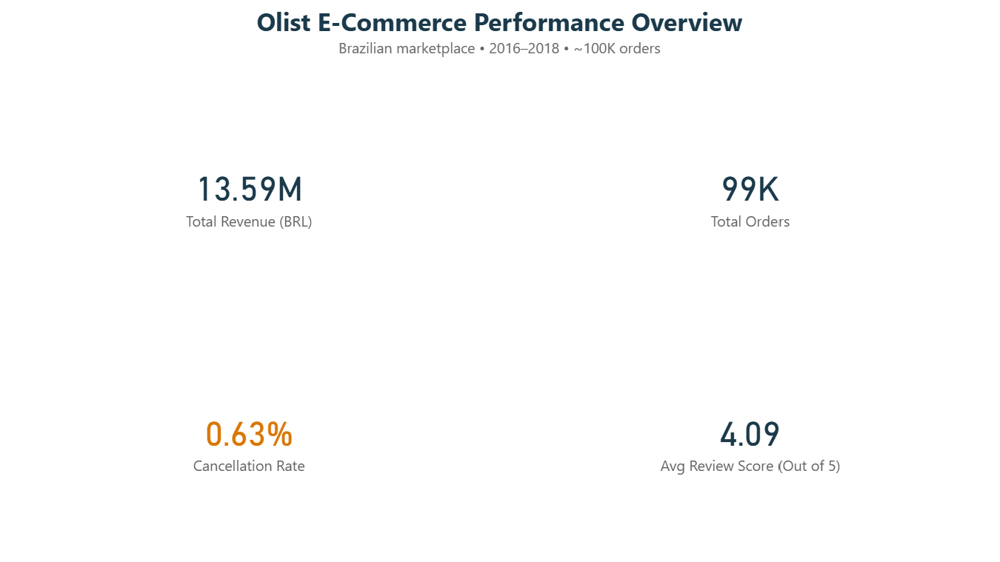
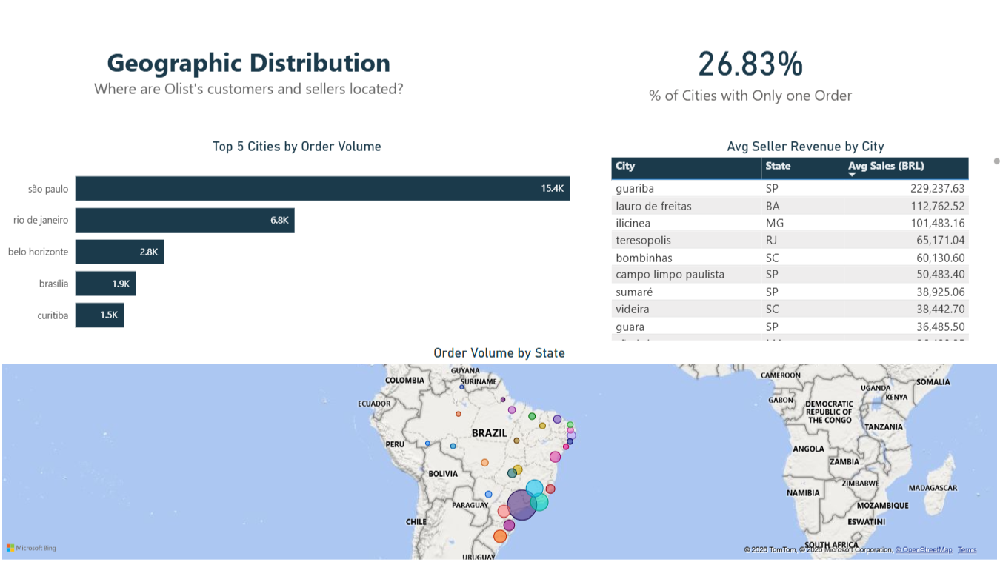
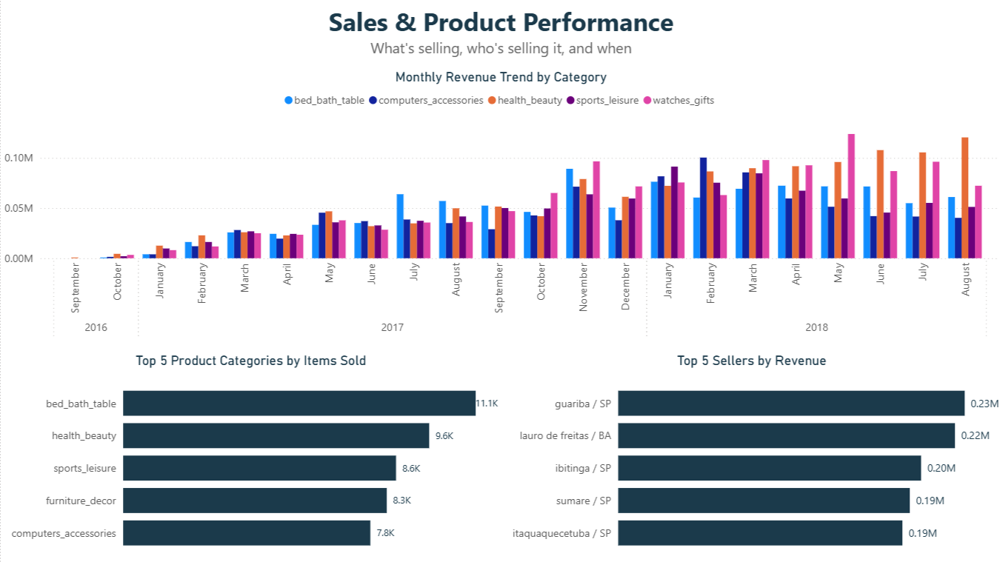
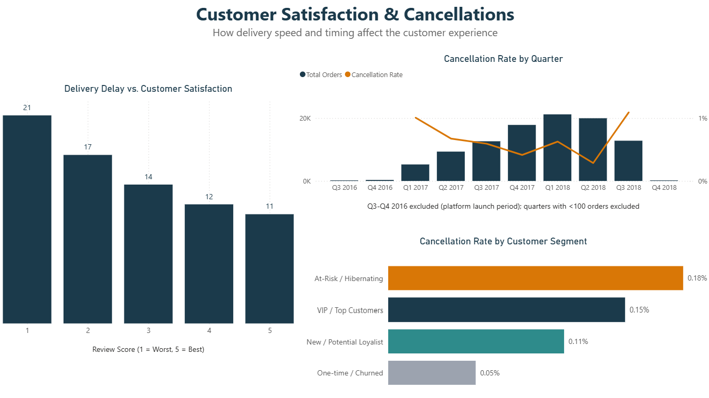
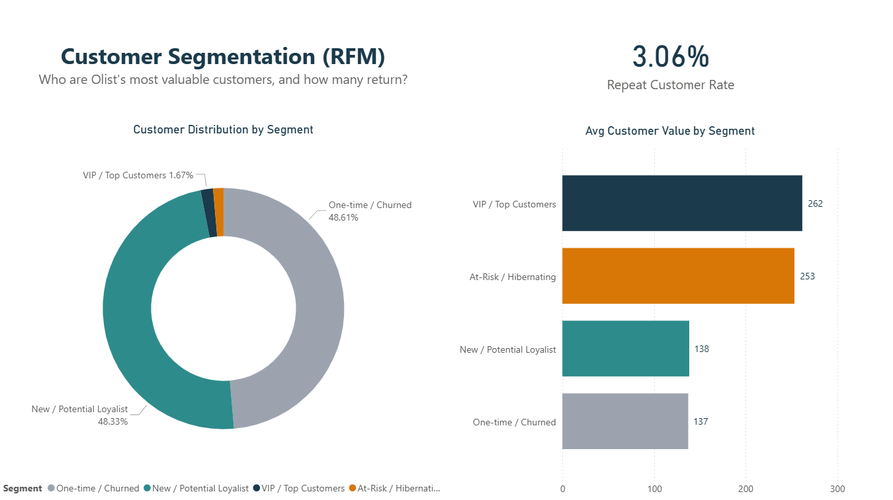

# Olist E-Commerce Analysis — Brazil (2016–2018)

An end-to-end data analytics project on the Brazilian E-Commerce Public
Dataset by Olist: from raw, imperfect data to a validated SQL analysis
layer, an interactive Power BI dashboard, and actionable business
recommendations.

## Project Overview

- **Dataset:** ~100,000 orders, 9 relational tables, 2016–2018
- **Tools:** MySQL 8.0, Power BI Desktop, Git/GitHub
- **Scope:** 11 business questions across 4 themes — Geography, Sales & Product Performance, Customer Satisfaction, and RFM Customer Segmentation
- **Deliverables:** A 5-page interactive dashboard, a fully documented SQL analysis layer, and a set of quantified business recommendations

## Dashboard

**Overview**

**Geographic Distribution**

**Sales & Product Performance**

**Customer Satisfaction & Cancellations**

**Customer Segmentation (RFM)**

## Key Findings

- Retention, not acquisition, is Olist's biggest growth lever: only **3.06%** of customers make a repeat purchase, yet at-risk (lapsing) customers are worth almost as much as active VIP customers (253 BRL vs. 262 BRL average).
- Delivery delay correlates strongly with satisfaction — average delay drops from **21 days** for 1-star reviews to **11 days** for 5-star reviews.
- Revenue is concentrated: the top 5 sellers alone generate ~7.7% of total revenue, and São Paulo alone accounts for ~15.6% of all orders.

Full write-up with business impact and recommendations: [`docs/insights_and_recommendations.md`](docs/insights_and_recommendations.md)

## Repository Structure

olist-ecommerce-analysis/
- sql/ — 11 analytical queries, one per business question
- powerbi/ — Power BI dashboard (.pbix)
- screenshots/ — Dashboard page exports
- docs/
  - insights_and_recommendations.md
  - known_limitations.md
- README.md

## Methodology Highlights

The raw dataset required substantial cleaning and validation before analysis — including deduplicating geolocation records, normalizing city names affected by a database collation mismatch (190 city-name pairs), and fixing a silent data-exclusion bug caused by an `INNER JOIN` in the customer segmentation logic. Every data quality issue encountered, along with the reasoning behind how it was resolved, is documented in [`docs/known_limitations.md`](docs/known_limitations.md).

## Data Source & License

Dataset: [Brazilian E-Commerce Public Dataset by Olist](https://www.kaggle.com/datasets/olistbr/brazilian-ecommerce) (Kaggle), licensed under **CC BY-NC-SA 4.0**. This analysis is for educational and portfolio purposes only (non-commercial use).
